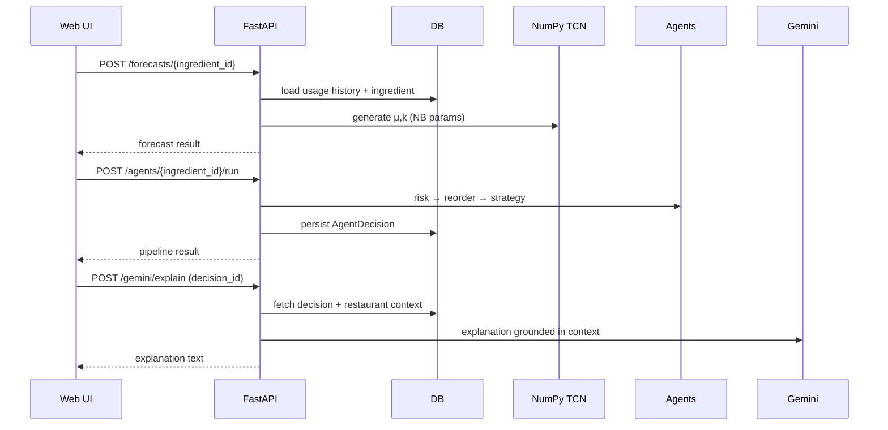
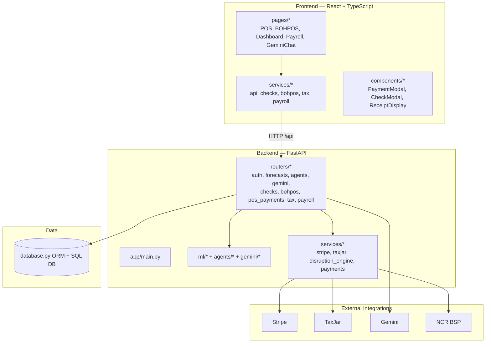
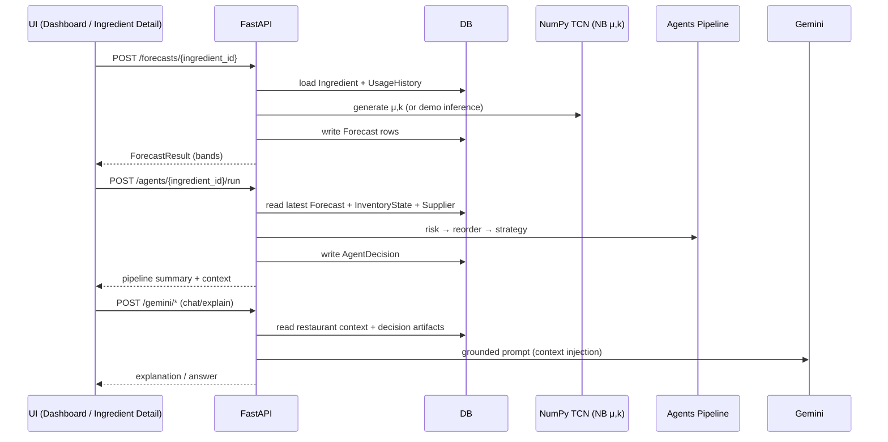
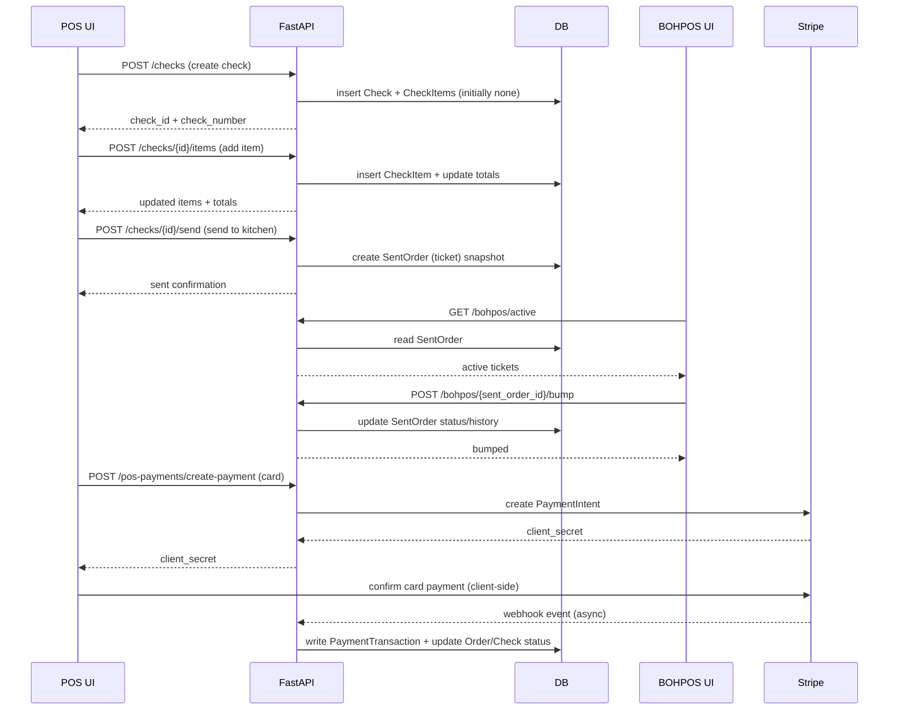
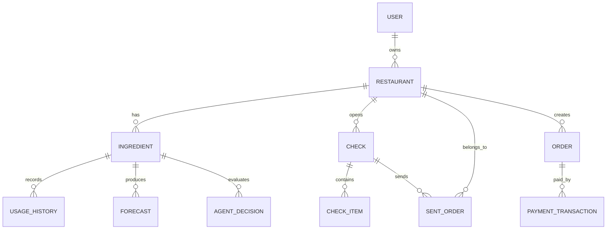

## WDYM86 — Sprint/Project Document (Technical Plan + Product Deliverables)

**Program**: UGAHacks (Inventory Intelligence Platform)  
**Course format**: Software Engineering Project (Hackathon-grade deliverable with production-grade structure)  
**Date**: 2026-02-07  

> This document is a **planning + execution** artifact: it defines sprint outcomes, acceptance criteria,
> and a technical blueprint, with direct traceability links to the implemented modules.

### Table of Contents

- [1.0 Introduction](#10-introduction)
  - [1.1 Team & Responsibilities](#11-team--responsibilities)
  - [1.2 System Overview & Scope](#12-system-overview--scope)
  - [1.3 Teamwork Norms (Operating System)](#13-teamwork-norms-operating-system)
  - [1.4 Problem Statement (Business)](#14-problem-statement-business)
  - [1.5 System Requirements (What We Actually Enforced)](#15-system-requirements-what-we-actually-enforced)
  - [1.6 Context + Activity Diagrams (Mermaid)](#16-context--activity-diagrams-mermaid)
- [2.0 Requirements](#20-requirements)
  - [2.1 Use Cases](#21-use-cases)
  - [2.2 Functional Requirements (Mapped to Code)](#22-functional-requirements-mapped-to-code)
  - [2.3 Non-Functional Requirements](#23-non-functional-requirements)
- [3.0 Data Model (Database Tables / ORM)](#30-data-model-database-tables--orm)
- [4.0 Class/Module Diagram](#40-classmodule-diagram)
- [5.0 Behavioral Modeling (Key Sequences)](#50-behavioral-modeling-key-sequences)
- [5.1 System Design Diagrams (Repo-Accurate)](#51-system-design-diagrams-repo-accurate)
- [6.0 Implementation (What’s Shipped)](#60-implementation-whats-shipped)
- [7.0 Testing](#70-testing)
- [8.0 Architectural Modeling](#80-architectural-modeling)
- [9.0 GitHub / Repo Operations](#90-github--repo-operations)
- [References](#references)

---

## 1.0 Introduction

WDYM86 is an AI-powered restaurant intelligence platform that combines:
- **Ground-up forecasting** in pure NumPy: TCN with **Negative Binomial** outputs and manual gradients
- **Autonomous agent pipeline**: risk → reorder optimization → supplier strategy
- **Gemini layer**: business-specific explanations and chat grounded in *restaurant DB context*
- **Operations suite**: POS + kitchen BOHPOS + floor plans + payroll + tax + payments + delivery integrations

Canonical source of truth for platform scope:
- `README.md`

## 1.1 Team & Responsibilities


- **[carter] — PM / Presenter**: scope control, demo narrative, acceptance criteria, sprint report.
- **[ibe,carter,shaw] — Frontend**: React pages, POS UX, BOHPOS, dashboards, auth flows.
- **[shaw/ibe] — Backend / DevOps**: FastAPI routers/services, DB models, config, local + docker run.
- **[ibe] — ML / Decision Logic**: NumPy TCN, NB loss/gradients, agent pipeline, disruption model.

## 1.2 System Overview & Scope

### Implemented platform capabilities (traceable to code)

**Forecasting + Agents (core differentiator)**
- Pure NumPy TCN (NB outputs μ, k): `backend/app/ml/tcn.py`
- NB NLL loss (manual grads): `backend/app/ml/losses.py`
- Orchestrated 3-agent pipeline: `backend/app/agents/orchestrator.py`
- Agents API: `backend/app/routers/agents.py`
- Forecast API (demo inference / uses DB history): `backend/app/routers/forecasts.py`
- Automated disruption engine (system-generated): `backend/app/services/disruption_engine.py`

**Gemini layer (explanations + chat; NOT RAG)**
- Gemini router with restaurant DB context injection: `backend/app/routers/gemini.py`
- Gemini client + explainer: `backend/app/gemini/client.py`, `backend/app/gemini/explainer.py`, `backend/app/gemini/prompts.py`
- Note: **RAG (embeddings/vector search) is not implemented** in this repo.

**Payments / Tax / Payroll**
- Stripe service: `backend/app/services/stripe_service.py`
- POS payments router: `backend/app/routers/pos_payments.py`
- TaxJar service + tax router: `backend/app/services/taxjar_service.py`, `backend/app/routers/tax.py`
- Payroll router + frontend wiring: `backend/app/routers/payroll.py`, `frontend/src/pages/Payroll.tsx`, `frontend/src/services/payroll.ts`

**POS + BOHPOS workflow**
- Check-first POS + demo-mode fallback: `frontend/src/pages/POS.tsx`
- BOHPOS kitchen display: `frontend/src/pages/BOHPOS.tsx`
- Check/BOHPOS services: `frontend/src/services/checks.ts`, `frontend/src/services/bohpos.ts`
- Navigation restrictions: `frontend/src/guards/NavigationGuard.tsx`

### Sprint focus (why these deliverables matter)

Because WDYM86 is a broad platform, this sprint document emphasizes:
- measurable end-to-end flows (forecast → agent → explanation; POS → payment → audit; kitchen bump)
- platform risks (backend availability, key configuration, demo-mode behavior, security)
- what is “demo-quality” vs “production-quality”

## 1.3 Teamwork Norms (Operating System)

- **MVP-first**: always keep an end-to-end path demoable.
- **Timeboxed decisions**: every 2–3 hours — Done / Next / Blocked / Cutlist.
- **Main is demo-stable**: feature work branches merge only after smoke checks.
- **Definition of Done**:
  - feature works in demo mode *and* backend-connected mode (when applicable)
  - clear errors for missing configs (keys, backend down)
  - minimal docs for run/test

## 1.4 Problem Statement (Business)

Restaurants face high variance demand, supplier lead times, perishability, and operational complexity:
- **Stockouts** lose revenue and damage customer experience.
- **Over-ordering** increases waste and cash tied up in inventory.

WDYM86 provides:
- probabilistic forecasts (uncertainty-aware, count data)
- explainable risk and reorder actions via agents + Gemini
- operational surfaces (POS, BOH, payroll, tax, integrations)

## 1.5 System Requirements (What We Actually Enforced)

### Non-negotiable ML constraint
- Forecasting and loss/gradients implemented **from scratch in NumPy** (no PyTorch/TensorFlow).
- NB count-modeling is first-class:
  - TCN outputs **μ** and **k** (dispersion), not Gaussian variance.

### AI explanation constraint
- Gemini is used for **explanation and chat**, grounded in restaurant data context.
- **RAG is not implemented** (no embeddings/vector database retrieval).

### Operational constraints
- Payments must support:
  - subscriptions (pricing)
  - POS payments (card/cash; webhooks for reliability)
- Tax must support:
  - TaxJar when configured
  - fallback default rates when not configured

## 1.6 Context + Activity Diagrams (Mermaid)

### Context diagram

```mermaid
flowchart LR
  RM[Restaurant Staff / Manager] --> UI[React Web UI]
  UI --> API[FastAPI Backend]
  API --> DB[(SQL Database)]
  API --> GEM[Gemini Layer\n(explain/chat)]
  API --> ML[NumPy Forecasting\nTCN + NB Loss]
  API --> AG[Agent Pipeline\nRisk→Reorder→Strategy]
  API --> STRIPE[Stripe]
  API --> TAXJAR[TaxJar]
```

### Core activity flow (inventory intelligence)



---

## 2.0 Requirements

## 2.1 Use Cases

- **UC1**: Manager views ingredient risk ranking (dashboard).
- **UC2**: Manager runs agent pipeline for an ingredient and sees reorder actions.
- **UC3**: Manager asks “why” and receives Gemini explanation grounded in restaurant context.
- **UC4**: POS staff creates a check, adds items, sends to BOHPOS.
- **UC5**: Kitchen staff sees active tickets in BOHPOS and bumps orders.
- **UC6**: Staff processes payment (card/cash), with audit trail.
- **UC7**: Sales tax is calculated via TaxJar or fallback.
- **UC8**: Payroll pages pull real data (employees, pay runs, expenses).

## 2.2 Functional Requirements (Mapped to Code)

**Forecasting**
- Model: TCN with NB output μ,k: `backend/app/ml/tcn.py`
- Loss: NB NLL + manual gradients: `backend/app/ml/losses.py`
- Endpoint: `backend/app/routers/forecasts.py`

**Agents**
- Pipeline: `backend/app/agents/orchestrator.py`
- Endpoint: `backend/app/routers/agents.py`

**Gemini (explain/chat)**
- Router: `backend/app/routers/gemini.py`
- System prompts: `backend/app/gemini/prompts.py`
- Client: `backend/app/gemini/client.py`

**POS / BOHPOS**
- POS UI: `frontend/src/pages/POS.tsx`
- BOHPOS UI: `frontend/src/pages/BOHPOS.tsx`
- Check endpoints: `backend/app/routers/checks.py`
- BOHPOS endpoints: `backend/app/routers/bohpos.py`

**Payments**
- Stripe service: `backend/app/services/stripe_service.py`
- POS payments: `backend/app/routers/pos_payments.py`
- Webhooks: `backend/app/routers/stripe_webhooks.py`

**Tax**
- Tax router: `backend/app/routers/tax.py`
- TaxJar service: `backend/app/services/taxjar_service.py`
- Frontend tax client: `frontend/src/services/tax.ts`

**Payroll**
- Backend payroll router: `backend/app/routers/payroll.py`
- Frontend page/service: `frontend/src/pages/Payroll.tsx`, `frontend/src/services/payroll.ts`

## 2.3 Non-Functional Requirements

- **Demo reliability**: graceful fallbacks and fast failure modes.
- **Security hygiene**: API key masking middleware exists in `backend/app/main.py`.
- **Performance**: avoid “infinite loading” when backend is down (timeout patterns exist in frontend services).

---

## 3.0 Data Model (Database Tables / ORM)

Authoritative ORM model file:
- `backend/app/database.py`

High-level entities include:
- Tenancy/auth: `User`, `Restaurant`, `StaffMember`
- Inventory/forecast: `Ingredient`, `UsageHistory`, `Forecast`, `InventoryState`
- Decisions: `AgentDecision`
- POS: `Order`, `OrderItem`, `Table`, `Customer`, `PaymentTransaction`, plus check/bohpos models
- Ops: floor plans, disruptions, daily snapshots

---

## 4.0 Class/Module Diagram

Use the folder structure as the “module diagram”:
- Backend:
  - `backend/app/ml/*` (model + training + losses)
  - `backend/app/agents/*` (agent policy logic)
  - `backend/app/gemini/*` (LLM integration)
  - `backend/app/routers/*` (API surface)
  - `backend/app/services/*` (integrations/business services)
- Frontend:
  - `frontend/src/pages/*` (screens)
  - `frontend/src/services/*` (API clients)
  - `frontend/src/components/*` (UI building blocks)

---

## 5.0 Behavioral Modeling (Key Sequences)

See:
- Inventory intelligence: `/forecasts` → `/agents` → `/gemini`
- POS operations: `/checks` → `/bohpos` → `/pos-payments` → `/stripe_webhooks`

---

## 5.1 System Design Diagrams (Repo-Accurate)

These diagrams are designed to be **implementation-traceable** to the current repo structure:
- Backend entry point: `backend/app/main.py`
- Routers: `backend/app/routers/*`
- Services: `backend/app/services/*`
- ML/Agents/Gemini: `backend/app/ml/*`, `backend/app/agents/*`, `backend/app/gemini/*`
- Frontend entry point: `frontend/src/main.tsx`
- Frontend pages/services/components: `frontend/src/pages/*`, `frontend/src/services/*`, `frontend/src/components/*`

### 5.1.1 System context diagram

```mermaid
flowchart LR
  Staff[Restaurant Staff<br/>(admin/manager/pos/boh)] --> UI[Web UI<br/>(React + TS)]
  UI --> API[FastAPI Backend]
  API --> DB[(SQL Database<br/>SQLite dev / Postgres prod)]
  API --> Stripe[Stripe]
  API --> TaxJar[TaxJar]
  API --> Gemini[Gemini API]
  API --> NCR[NCR BSP APIs<br/>(optional integration)]
  API --> Solana[Solana Pay<br/>(optional)]
```

### 5.1.2 Container diagram (Frontend / Backend / Data / Integrations)



### 5.1.3 Data flow (Inventory intelligence: forecast → agents → explanation)



### 5.1.4 Data flow (POS: check → send to BOHPOS → payment)



### 5.1.5 High-level ERD (conceptual)

This is not a full schema dump; it’s a sprint/system-design view of core relationships.



---

## 6.0 Implementation (What’s Shipped)

Start here for full system description and run instructions:
- `README.md`

Backend entry point:
- `backend/app/main.py`

Frontend entry point:
- `frontend/src/main.tsx`

---

## 7.0 Testing

### Minimum “Sprint-grade” test suite (recommended)

- **Math invariants**
  - NB NLL finite for y≥0, μ>0, k>0
  - monotonic stockout probability vs inventory (agent layer)
- **API smoke**
  - `/health`, `/docs`, `/forecasts/{id}`, `/agents/{id}/run`, `/gemini/chat`
- **POS flow**
  - create check → add items → send to BOHPOS → bump → pay

Tooling present:
- `pytest` + `pytest-asyncio` in `backend/requirements.txt`

---

## 8.0 Architectural Modeling

Three-layer conceptual stack (as-built):
1. **Forecasting layer**: NumPy TCN + NB loss  
2. **Decision layer**: agents + disruption engine + tax/payments logic  
3. **Application layer**: FastAPI + React UI + role-based routes + integrations

---

## 9.0 GitHub / Repo Operations

- Default branch: `main`
- Workflow: feature branches → PR → merge; keep `main` demo-stable.

---

## References

- Mermaid Live Editor: https://mermaid.live
- Pydantic Settings: https://docs.pydantic.dev/latest/concepts/pydantic_settings/
- Stripe Docs: https://docs.stripe.com
- TaxJar Docs: https://developers.taxjar.com
